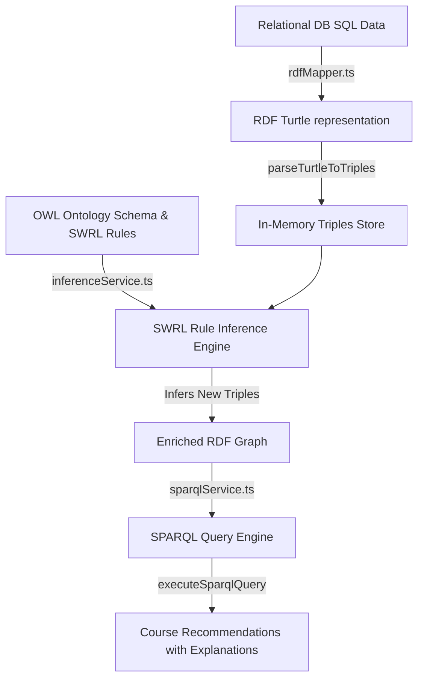

# LearnWise - Semantic Web-Enabled Course Recommender System

LearnWise is a modern, personalized learning and course recommendation dashboard built with Next.js and Tailwind CSS. The core intelligence of LearnWise is powered by a custom **Semantic Web Engine** that integrates RDF graphs, Turtle mappings, SPARQL query patterns, and SWRL rule reasoning to dynamically recommend learning paths, resolve skill gaps, and address weaknesses based on student profiles and quiz performance.

---

## 🚀 Getting Started

Follow these steps to set up and run the project locally.

### 1. Prerequisites
- **Node.js** (v18 or higher recommended)
- **npm** or another package manager (Yarn, pnpm)
- A **PostgreSQL** database (a serverless Neon database connection is already configured by default in `.env.local`).

### 2. Install Dependencies
Navigate into the `learnwise` directory and install the required npm packages:
```bash
npm install
```

### 3. Database Migration and Seeding
Initialize the database tables and populate them with the default categories, subcategories, subcategory relations, courses, and student profiles:
```bash
npx tsx src/lib/seed.ts
```
*Note: This script drops existing tables (if any) and creates a clean set of schemas and data.*

### 4. Run the Development Server
Start the Next.js development server:
```bash
npm run dev
```

Open [http://localhost:3000](http://localhost:3000) in your browser to interact with the application.

### 5. Verification Test (Optional)
To verify that the recommendation logic and the database connection are working as expected without starting the web server, run the test script:
```bash
npx tsx src/test_get_recs.ts
```

---

## 📂 Directory Structure

Here is a breakdown of the key files and folders in the project:

```text
learnwise/
├── public/                 # Static assets (images, videos, etc.)
├── src/
│   ├── app/                # Next.js App Router (pages and server actions)
│   │   ├── actions/        # Server Actions for DB operations & auth
│   │   │   ├── auth.ts            # Student login/registration & crypto hashing
│   │   │   ├── learningPaths.ts   # Enrolling, completing quizzes, and semantic feedback
│   │   │   ├── profile.ts         # Loading & editing student profiles/interests/skills
│   │   │   └── recommendation.ts  # Master recommendation router combining logic
│   │   ├── courses/        # Course catalog & filtering UI
│   │   ├── my-learning/    # Dashboard displaying enrolled courses and progress
│   │   ├── profile/        # Onboarding options, goals, skills, and wishlist tabs
│   │   ├── layout.tsx      # App wrapper with global styles & ThemeProvider
│   │   └── page.tsx        # Homepage dashboard (banners, features, and course details)
│   ├── components/         # Reusable UI components
│   │   ├── ui/             # Shadcn-based UI components (buttons, badges, inputs)
│   │   ├── navbar.tsx      # Responsive header with light/dark theme toggle
│   │   └── footer.tsx      # Site footer
│   ├── lib/                # Database configuration and custom utilities
│   │   ├── semantic/       # Core Semantic Web Engine 🧠
│   │   │   ├── ontology.ts          # OWL Ontology schema (classes, properties, SWRL rules)
│   │   │   ├── rdfMapper.ts         # Maps SQL tables to RDF Turtle syntax
│   │   │   ├── xmlMapper.ts         # Serializes profiles to XML for cold start logic
│   │   │   ├── inferenceService.ts  # SWRL/OWL rule reasoning pipeline
│   │   │   └── sparqlService.ts     # In-memory SPARQL execution & query templates
│   │   ├── db.ts           # Neon serverless client connection
│   │   └── seed.ts         # Database migration and seeding file
│   └── test_get_recs.ts    # Command-line test script for recommendations
├── .env.local              # Local environment file containing DATABASE_URL
├── package.json            # Node.js dependencies and run scripts
└── tailwind.config.ts      # Tailwind CSS styling settings
```

---

## 🧠 Underlying Logic & Recommendation Engine

LearnWise leverages both **Cold Start Matching** (Solution 1) and **RDF Graph + OWL SWRL Rule Reasoning** (Solution 2) to build a robust course recommendation system.



### 1. The Core Ontology (`ontology.ts`)
We model the learning domain using an OWL-like structure that defines:
- **Classes**: `Learner`, `Course`, `Skill`, `QuizQuestion`, `QuizResult`, `CareerGoal`
- **Hierarchies**: Skill Taxonomies (e.g., `PythonSkill` is a sub-class of `ProgrammingSkill`) and Career Path relationships.
- **Properties**: Object relationships like `hasGoal`, `requiresSkill`, `teachesSkill`, `hasPrerequisite`, `mastered`, `hasWeakness`, and `suitableFor`.

### 2. RDF Turtle Generation & Parsing (`rdfMapper.ts` & `inferenceService.ts`)
To bridge the gap between relational SQL databases and graph ontologies, LearnWise maps database tables to RDF:
- **Student Mapping**: Converts interests, goals, completed courses, and quiz attempts to Turtle format (`ex:Student1 rdf:type ex:Learner`).
- **Course Mapping**: Serializes titles, categories, teaches/requires skills, and associated quiz questions.
- **Review Mapping**: Binds course reviews and their NLP-extracted semantic concepts (`ex:Review101 ex:mentionsSkill ex:Python`).
- **Parsing**: A lightweight parser (`parseTurtleToTriples`) converts these Turtle strings into `RDFTriple` records (`{ s: subject, p: predicate, o: object }`) inside an in-memory graph store.

### 3. SWRL Rule Reasoning Engine (`inferenceService.ts`)
LearnWise simulates the logic of **SWRL (Semantic Web Rule Language)** on the in-memory RDF triple store:
- **Rule 1 (Detect Weakness / Mastery)**:
  $$\text{Learner}(?l) \land \text{attemptedQuiz}(?l, ?qr) \land \text{QuizResult}(?qr) \land \text{score}(?qr, ?score) \land \text{testsSkill}(?qr, ?s) \land \text{score} < 70 \rightarrow \text{hasWeakness}(?l, ?s)$$
  If a student scores below 70% on a quiz testing a skill, the engine automatically adds the triple `(?l, ex:hasWeakness, ?s)`. If they score 70% or above, it asserts `(?l, ex:mastered, ?s)`.
- **Rule 2 (Recommend Course for Weakness)**:
  $$\text{Learner}(?l) \land \text{hasWeakness}(?l, ?s) \land \text{Course}(?c) \land \text{teachesSkill}(?c, ?s) \rightarrow \text{recommendedFor}(?c, ?l)$$
  Recommends courses that teach the skill (?s) in which the learner has a registered weakness.
- **Rule 3 (Recommend Next Step / Prerequisites Met)**:
  $$\text{Learner}(?l) \land \text{mastered}(?l, ?s) \land \text{Course}(?c) \land \text{requiresSkill}(?c, ?s) \land \text{notCompleted}(?l, ?c) \rightarrow \text{suitableFor}(?c, ?l)$$
  Suggests courses as "suitable next steps" if the learner has mastered the prerequisite skills and has not yet completed the course.

### 4. SPARQL Queries (`sparqlService.ts` & `recommendation.ts`)
Once the graph store is enriched by the reasoning engine, we evaluate SPARQL queries to query the recommendations:
- **Cold Start (Solution 1)**: Matches courses to the user's academic background (e.g., Computer Science backgrounds recommend programming courses), expressed category interests, and target goals.
- **Review Semantic Matching**: Finds highly rated courses (rating $\ge 4$) that mention concepts matching user interests.
- **Goal Requirements Query**: Finds courses teaching skills required by the student's selected career path.
- **Weakness & Next Step Queries**: Queries the inferred triples `ex:recommendedFor` and `ex:suitableFor` to output the course recommendations along with descriptive, human-readable explanations of *why* they are being recommended.

---

## 🛠️ Dynamic Interactive Workflows

- **Interactive Onboarding**: Students select their learning goals (e.g., *Software Developer*, *Business Manager*), skill levels, and specific interests. These are saved to `student_profiles` and used for immediate Cold Start suggestions.
- **Quiz Performance Loop**: In the "My Learning" tab, students can click a course, expand its levels, and take quizzes. Scoring low on a quiz writes a weakness concept back to the database, which immediately changes the recommendations in real-time.
- **Explicit Semantic Feedback**: If a student removes a course from their active learning path, they are asked for a reason. Depending on their selection, the system updates the graph logic:
  - *Too easy*: Marks all course skills as `mastered` (adds 100% quiz scores).
  - *Too difficult*: Marks all course skills as a `weakness` (adds 30% quiz scores).
  - *Not interested*: Deletes the subcategory interest from the student's profile.
  - *Poor quality*: Rates the course 1-star, completely excluding it from future recommendations.

